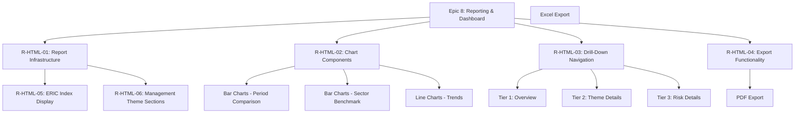
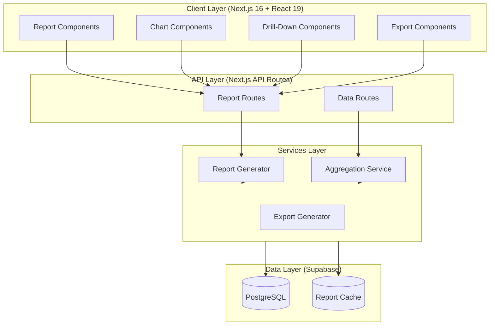
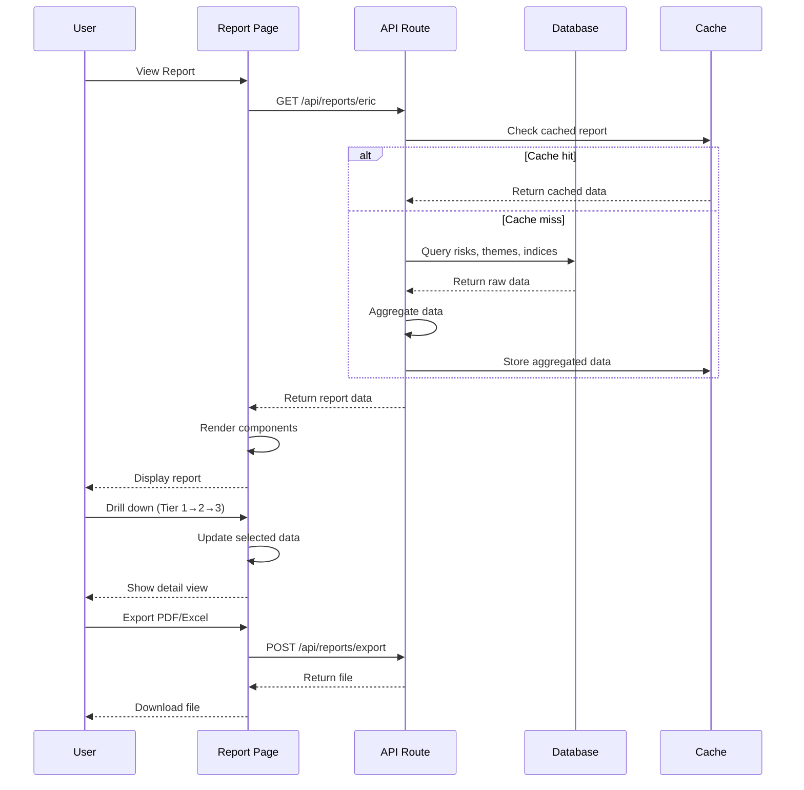
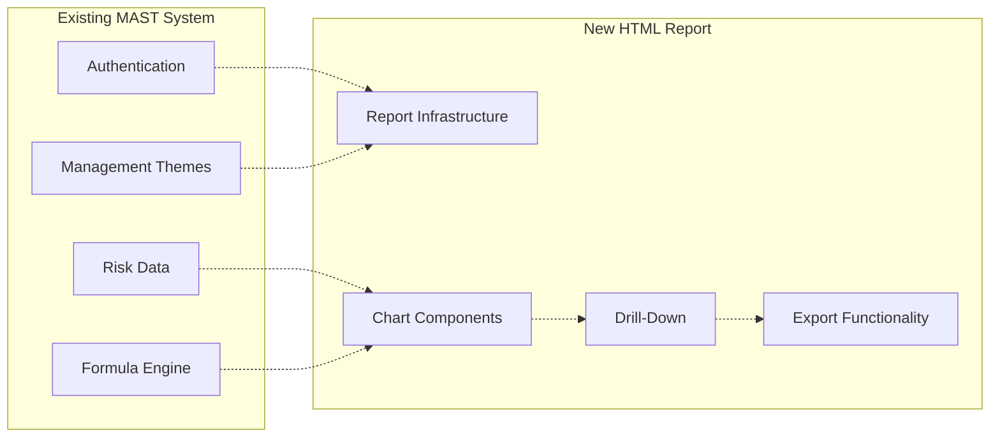
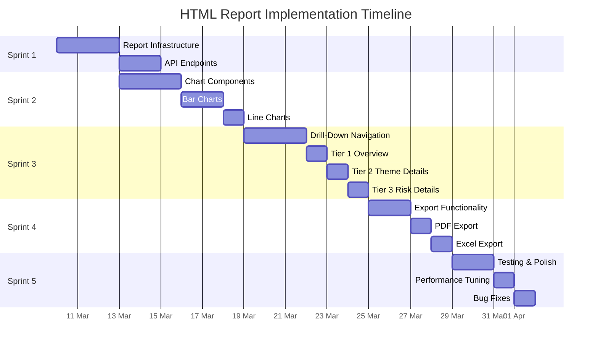

# BMAD Plan: MAST HTML Report Generation - HTML_DRAFT Task

> **Project:** MAST (Management Assessment and Systems Tool)
> **Task:** HTML Report Generation - Replicate ERIC Report Format
> **Branch:** HTML_DRAFT (https://github.com/nicopt-io/mast)
> **User:** Tanjim
> **Date:** March 2026
> **Version:** 1.0

---

## 1. Executive Summary

### 1.1 Project Overview

The MAST HTML Report Generation project aims to create a web-based reporting system that replicates the current ERIC (Evidence, Research, Innovation, Impact, Outcomes) PDF report format used by Marine and Safety Tasmania. This project will enable clients to self-generate reports without manual intervention, addressing the core pain point of emailing Martin for report generation.

### 1.2 Key Objectives

| Objective | Description | Priority |
|-----------|-------------|----------|
| **Replicate ERIC Format** | Create HTML report matching Report - ERIC.pdf layout | Must Have |
| **Interactive Charts** | Bar charts (previous/current period, sector benchmark), line charts | Must Have |
| **Drill-Down Reports** | Enable 3-tier drill-down navigation | Must Have |
| **Export Functionality** | PDF and Excel export capabilities | Must Have |
| **Formula Automation** | Support 2,415 formulas across 287 Entry IDs | Must Have |
| **Theme Support** | 6 custom management themes | Must Have |

### 1.3 Scope

- **In Scope:**
  - HTML report generation matching ERIC.pdf format
  - Interactive bar charts (previous/current period, sector benchmark)
  - Interactive line charts for trend analysis
  - Drill-down reports (maximum 3 tiers)
  - PDF export functionality
  - Excel export functionality
  - Integration with existing MAST database

- **Out of Scope:**
  - Modifying existing data entry workflows
  - Creating new authentication mechanisms
  - Mobile-responsive report layouts (Phase 2)

### 1.4 Success Criteria

1. HTML report displays all 5 ERIC indices (Evidence, Research, Innovation, Impact, Outcomes)
2. Bar charts show previous period vs current period comparison
3. Sector benchmark bar charts display comparative data
4. Line charts visualize trends across reporting periods
5. Drill-down navigation works for up to 3 tiers
6. PDF export produces document matching ERIC.pdf format
7. Excel export includes all raw data with formulas intact
8. Report loads within 30 seconds for 287 Entry IDs
9. Role-based access controls enforced (Admin, Manager, Contributor, Viewer)

---

## 2. Epic Breakdown

### 2.1 Epic Overview

Based on the existing EPICS.md and the HTML Report requirements, the following epics are prioritized for the HTML_DRAFT task:



### 2.2 Epic Details

#### Epic R-HTML-01: Report Infrastructure

| Attribute | Value |
|-----------|-------|
| **Priority** | Must Have |
| **Effort Estimate** | 13 points |
| **Dependencies** | Epic 5 (Risk Management), Epic 6 (Data Processing) |
| **Stories** | R-ST-001, R-ST-002, R-ST-003 |

**Description:** Establish the foundational infrastructure for HTML report generation, including API endpoints, data aggregation services, and base layout components.

---

#### Epic R-HTML-02: Chart Components

| Attribute | Value |
|-----------|-------|
| **Priority** | Must Have |
| **Effort Estimate** | 21 points |
| **Dependencies** | R-HTML-01 |
| **Stories** | R-ST-004, R-ST-005, R-ST-006, R-ST-007 |

**Description:** Implement interactive chart components including bar charts for period comparison and sector benchmarks, and line charts for trend analysis.

---

#### Epic R-HTML-03: Drill-Down Navigation

| Attribute | Value |
|-----------|-------|
| **Priority** | Must Have |
| **Effort Estimate** | 15 points |
| **Dependencies** | R-HTML-01, R-HTML-02 |
| **Stories** | R-ST-008, R-ST-009, R-ST-010 |

**Description:** Create hierarchical drill-down navigation allowing users to explore data from overview (Tier 1) through theme details (Tier 2) to individual risk details (Tier 3).

---

#### Epic R-HTML-04: Export Functionality

| Attribute | Value |
|-----------|-------|
| **Priority** | Must Have |
| **Effort Estimate** | 10 points |
| **Dependencies** | R-HTML-01, R-HTML-02, R-HTML-03 |
| **Stories** | R-ST-011, R-ST-012 |

**Description:** Implement PDF and Excel export capabilities that replicate the ERIC.pdf format.

---

### 2.3 Epic Summary Table

| Epic ID | Name | Priority | Points | Dependencies |
|---------|------|----------|--------|--------------|
| R-HTML-01 | Report Infrastructure | Must Have | 13 | Epic 5, Epic 6 |
| R-HTML-02 | Chart Components | Must Have | 21 | R-HTML-01 |
| R-HTML-03 | Drill-Down Navigation | Must Have | 15 | R-HTML-01, R-HTML-02 |
| R-HTML-04 | Export Functionality | Must Have | 10 | R-HTML-01, R-HTML-02, R-HTML-03 |
| **Total** | | | **59** | |

---

## 3. User Stories (FR-RPT-01 to FR-RPT-13)

### 3.1 Functional Requirements Mapping

The following 13 functional requirements have been identified for the HTML Report feature:

| FR ID | Requirement | Epic | Priority |
|-------|-------------|------|----------|
| FR-RPT-01 | Generate ERIC report from database | R-HTML-01 | Must Have |
| FR-RPT-02 | Display 5 ERIC indices (E, R, I, I, O) | R-HTML-01 | Must Have |
| FR-RPT-03 | Bar chart - Previous vs Current period | R-HTML-02 | Must Have |
| FR-RPT-04 | Bar chart - Sector benchmark comparison | R-HTML-02 | Must Have |
| FR-RPT-05 | Line chart - Trend visualization | R-HTML-02 | Must Have |
| FR-RPT-06 | Drill-down Tier 1: Overview | R-HTML-03 | Must Have |
| FR-RPT-07 | Drill-down Tier 2: Theme details | R-HTML-03 | Must Have |
| FR-RPT-08 | Drill-down Tier 3: Risk details | R-HTML-03 | Must Have |
| FR-RPT-09 | PDF Export | R-HTML-04 | Must Have |
| FR-RPT-10 | Excel Export | R-HTML-04 | Must Have |
| FR-RPT-11 | Role-based report access | R-HTML-01 | Must Have |
| FR-RPT-12 | Report caching for performance | R-HTML-01 | Should Have |
| FR-RPT-13 | Report scheduling | R-HTML-04 | Could Have |

### 3.2 User Stories Detail

#### R-ST-001: Report Generation API
**As a** Data Contributor,
**I want** to generate an ERIC report from the database,
**So that** I can view the current state of all risk metrics.

| Field | Value |
|-------|-------|
| Priority | Must Have |
| Points | 5 |
| Dependencies | Epic 6 (Data Processing) |
| Acceptance Criteria | - Report generates within 30 seconds<br>- All 287 Entry IDs are included<br>- Formulas (2,415) are calculated correctly |

---

#### R-ST-002: ERIC Index Display
**As a** Viewer,
**I want** to see all 5 ERIC indices displayed in the report,
**So that** I can understand the overall performance across Evidence, Research, Innovation, Impact, and Outcomes.

| Field | Value |
|-------|-------|
| Priority | Must Have |
| Points | 3 |
| Dependencies | R-ST-001 |
| Acceptance Criteria | - All 5 indices are visible<br>- Each index shows aggregate score<br>- Indices are ordered E, R, I, I, O |

---

#### R-ST-003: Management Theme Sections
**As a** Manager,
**I want** to see data organized by the 6 management themes,
**So that** I can understand which themes require attention.

| Field | Value |
|-------|-------|
| Priority | Must Have |
| Points | 5 |
| Dependencies | R-ST-001 |
| Acceptance Criteria | - All 6 themes are displayed<br>- Each theme shows aggregate metrics<br>- Themes can be expanded/collapsed |

---

#### R-ST-004: Bar Chart - Previous vs Current Period
**As a** Manager,
**I want** to compare previous period data with current period data using bar charts,
**So that** I can identify trends and changes over time.

| Field | Value |
|-------|-------|
| Priority | Must Have |
| Points | 8 |
| Dependencies | R-ST-001 |
| Acceptance Criteria | - Side-by-side bars for each metric<br>- Clear labeling of "Previous Period" and "Current Period"<br>- Color differentiation between periods |

---

#### R-ST-005: Bar Chart - Sector Benchmark
**As a** Board Member,
**I want** to compare our metrics against sector benchmarks,
**So that** I can understand our performance relative to similar organizations.

| Field | Value |
|-------|-------|
| Priority | Must Have |
| Points | 5 |
| Dependencies | R-ST-004 |
| Acceptance Criteria | - Bar chart shows organization data vs benchmark<br>- Benchmark data is configurable<br>- Visual indicator for above/below benchmark |

---

#### R-ST-006: Line Chart - Trend Visualization
**As a** Manager,
**I want** to see trends over multiple periods using line charts,
**So that** I can identify patterns and make informed decisions.

| Field | Value |
|-------|-------|
| Priority | Must Have |
| Points | 5 |
| Dependencies | R-ST-004 |
| Acceptance Criteria | - Line chart shows data across at least 4 periods<br>- Multiple lines for different metrics<br>- Interactive tooltips on hover |

---

#### R-ST-007: Interactive Chart Tooltips
**As a** Viewer,
**I want** to hover over chart elements to see detailed values,
**So that** I can understand the exact numbers behind visualizations.

| Field | Value |
|-------|-------|
| Priority | Should Have |
| Points | 3 |
| Dependencies | R-ST-004, R-ST-005, R-ST-006 |
| Acceptance Criteria | - Tooltips appear on hover<br>- Tooltips show exact values<br>- Tooltips are accessible |

---

#### R-ST-008: Drill-Down Tier 1 - Overview
**As a** Board Member,
**I want** to see a high-level overview of all metrics,
**So that** I can quickly understand the organization's risk posture.

| Field | Value |
|-------|-------|
| Priority | Must Have |
| Points | 5 |
| Dependencies | R-ST-002, R-ST-003 |
| Acceptance Criteria | - Shows summary of all 5 ERIC indices<br>- Displays all 6 management themes<br>- Quick navigation to deeper tiers |

---

#### R-ST-009: Drill-Down Tier 2 - Theme Details
**As a** Manager,
**I want** to explore details within a specific management theme,
**So that** I can analyze performance within my area of responsibility.

| Field | Value |
|-------|-------|
| Priority | Must Have |
| Points | 5 |
| Dependencies | R-ST-008 |
| Acceptance Criteria | - Shows all risk domains within theme<br>- Displays relevant charts for theme<br>- Navigation to Tier 3 for specific risks |

---

#### R-ST-010: Drill-Down Tier 3 - Risk Details
**As a** Data Contributor,
**I want** to view detailed information about a specific risk,
**So that** I can understand the factors affecting that risk.

| Field | Value |
|-------|-------|
| Priority | Must Have |
| Points | 5 |
| Dependencies | R-ST-009 |
| Acceptance Criteria | - Shows all data fields for risk<br>- Historical values displayed<br>- Back navigation to Tier 2 |

---

#### R-ST-011: PDF Export
**As a** Administrator,
**I want** to export reports to PDF format,
**So that** I can share printed reports with stakeholders.

| Field | Value |
|-------|-------|
| Priority | Must Have |
| Points | 5 |
| Dependencies | R-ST-001, R-ST-002, R-ST-003 |
| Acceptance Criteria | - PDF matches ERIC.pdf format<br>- All charts are included<br>- Page breaks are appropriate |

---

#### R-ST-012: Excel Export
**As a** Data Contributor,
**I want** to export data to Excel format,
**So that** I can perform additional analysis offline.

| Field | Value |
|-------|-------|
| Priority | Must Have |
| Points | 5 |
| Dependencies | R-ST-001 |
| Acceptance Criteria | - All raw data is exported<br>- Formulas are preserved<br>- Multiple sheets for different data types |

---

#### R-ST-013: Role-Based Report Access
**As a** Administrator,
**I want** to control who can view and generate reports,
**So that** sensitive information is protected.

| Field | Value |
|-------|-------|
| Priority | Must Have |
| Points | 3 |
| Dependencies | Epic 1 (Authentication) |
| Acceptance Criteria | - Admins can view all reports<br>- Managers see their domain reports only<br>- Viewers have read-only access |

---

### 3.3 User Stories Summary

| Story ID | Title | Priority | Points | Epic |
|----------|-------|----------|--------|------|
| R-ST-001 | Report Generation API | Must Have | 5 | R-HTML-01 |
| R-ST-002 | ERIC Index Display | Must Have | 3 | R-HTML-01 |
| R-ST-003 | Management Theme Sections | Must Have | 5 | R-HTML-01 |
| R-ST-004 | Bar Chart - Period Comparison | Must Have | 8 | R-HTML-02 |
| R-ST-005 | Bar Chart - Sector Benchmark | Must Have | 5 | R-HTML-02 |
| R-ST-006 | Line Chart - Trends | Must Have | 5 | R-HTML-02 |
| R-ST-007 | Interactive Chart Tooltips | Should Have | 3 | R-HTML-02 |
| R-ST-008 | Drill-Down Tier 1 - Overview | Must Have | 5 | R-HTML-03 |
| R-ST-009 | Drill-Down Tier 2 - Theme Details | Must Have | 5 | R-HTML-03 |
| R-ST-010 | Drill-Down Tier 3 - Risk Details | Must Have | 5 | R-HTML-03 |
| R-ST-011 | PDF Export | Must Have | 5 | R-HTML-04 |
| R-ST-012 | Excel Export | Must Have | 5 | R-HTML-04 |
| R-ST-013 | Role-Based Report Access | Must Have | 3 | R-HTML-01 |
| **Total** | | | **62** | |

---

## 4. Technical Approach and Architecture

### 4.1 Architecture Overview

The HTML Report generation will follow a component-based architecture within the existing MAST Next.js application:



### 4.2 Technology Stack

| Component | Technology | Purpose |
|-----------|------------|---------|
| Frontend Framework | Next.js 16 | App Router, Server Components |
| UI Library | React 19 | Component-based UI |
| Styling | Tailwind CSS v4 | Responsive design |
| Charts | Recharts | Bar charts, line charts |
| PDF Generation | @react-pdf/renderer | PDF export |
| Excel Export | xlsx (SheetJS) | Excel export |
| Database | Supabase (PostgreSQL) | Data storage |
| Caching | Redis (optional) | Report caching |

### 4.3 Component Architecture

#### Report Page Structure
```
app/mast/reports/
├── page.tsx                    # Main report page (Server Component)
├── layout.tsx                  # Report layout
├── loading.tsx                # Loading state
├── components/
│   ├── ReportHeader.tsx       # Report title, period selector
│   ├── ERICIndices.tsx        # 5 indices summary cards
│   ├── ManagementThemes.tsx  # 6 theme sections
│   ├── charts/
│   │   ├── BarChartPeriod.tsx      # Previous/Current comparison
│   │   ├── BarChartBenchmark.tsx   # Sector benchmark
│   │   └── LineChartTrends.tsx     # Trend lines
│   ├── drilldown/
│   │   ├── Tier1Overview.tsx       # Overview component
│   │   ├── Tier2Theme.tsx          # Theme details
│   │   └── Tier3Risk.tsx           # Risk details
│   └── export/
│       ├── PDFExport.tsx            # PDF export button
│       └── ExcelExport.tsx          # Excel export button
└── lib/
    ├── report-data.ts       # Data fetching logic
    ├── aggregation.ts       # Data aggregation
    └── export-pdf.ts        # PDF generation
```

### 4.4 Data Flow



### 4.5 Key Technical Decisions

| Decision | Rationale |
|----------|-----------|
| **Server Components for Data Fetching** | Reduce client bundle size, improve performance |
| **Recharts for Visualizations** | Native React integration, good performance |
| **@react-pdf/renderer for PDF** | Precise control over PDF layout matching ERIC format |
| **Client-side caching with SWR** | Reduce API calls for frequently accessed data |
| **Incremental Static Regeneration** | Pre-render report pages for faster loading |

---

## 5. Dependencies and Integration Points

### 5.1 Internal Dependencies

| Dependency | Description | Impact |
|------------|-------------|--------|
| **Epic 1: Authentication** | User authentication and session management | Required for role-based access |
| **Epic 3: Data Structure** | Management themes (6) and risk domains (19) | Required for report organization |
| **Epic 5: Risk Management** | Risk data (287 Entry IDs) | Required for report content |
| **Epic 6: Data Processing** | Formula automation (2,415 formulas) | Required for calculated values |

### 5.2 External Dependencies

| Dependency | Source | Purpose |
|------------|--------|---------|
| **Supabase Database** | Existing MAST setup | Data storage and retrieval |
| **Recharts** | npm package | Chart visualizations |
| **@react-pdf/renderer** | npm package | PDF generation |
| **xlsx (SheetJS)** | npm package | Excel export |

### 5.3 Integration Points



### 5.4 API Endpoints

| Method | Endpoint | Description | Access |
|--------|----------|-------------|--------|
| GET | `/api/reports/eric` | Get ERIC report data | Viewer+ |
| GET | `/api/reports/eric/[period]` | Get report for specific period | Viewer+ |
| GET | `/api/reports/eric/indices` | Get ERIC index scores | Viewer+ |
| GET | `/api/reports/eric/themes/[id]` | Get theme details | Manager+ |
| GET | `/api/reports/eric/risks/[id]` | Get risk details | Contributor+ |
| POST | `/api/reports/export/pdf` | Export to PDF | Contributor+ |
| POST | `/api/reports/export/excel` | Export to Excel | Contributor+ |

---

## 6. Risk Assessment and Mitigation

### 6.1 Risk Register

| Risk ID | Risk Description | Probability | Impact | Severity | Mitigation Strategy |
|---------|------------------|-------------|--------|----------|---------------------|
| R-001 | Performance issues with 287 Entry IDs | High | High | **Critical** | Implement caching, pagination, and lazy loading |
| R-002 | PDF export doesn't match ERIC.pdf format | Medium | High | **High** | Detailed spec review, iterative testing against PDF |
| R-003 | Formula calculation discrepancies | Medium | High | **High** | Comprehensive test cases, compare against Excel |
| R-004 | Chart rendering performance | Medium | Medium | **Medium** | Use Recharts virtualization, limit data points |
| R-005 | Drill-down navigation complexity | Low | Medium | **Low** | Clear UI patterns, breadcrumb navigation |
| R-006 | Role-based access complexity | Low | Medium | **Low** | Reuse existing auth infrastructure |
| R-007 | Excel export formula compatibility | Medium | Medium | **Medium** | Test with various Excel versions |
| R-008 | Browser compatibility for charts | Low | Low | **Low** | Test across major browsers |

### 6.2 Critical Risk Mitigation Plans

#### R-001: Performance with Large Dataset

**Mitigation Plan:**
1. Implement Redis caching for aggregated report data
2. Use database-level aggregation (SQL) instead of application-level
3. Implement pagination for detailed views
4. Use React Server Components to reduce client bundle
5. Implement lazy loading for chart components

**Trigger:** Report generation takes longer than 30 seconds
**Response:** Enable caching, reduce data granularity

#### R-002: PDF Format Mismatch

**Mitigation Plan:**
1. Create detailed specification document mapping ERIC.pdf sections
2. Use pixel-perfect comparison tools during testing
3. Implement @react-pdf/renderer with exact styling
4. Conduct user review sessions with stakeholders

**Trigger:** PDF output differs from ERIC.pdf
**Response:** Iterate on styling, add missing sections

#### R-003: Formula Calculation Discrepancies

**Mitigation Plan:**
1. Document all 2,415 formulas from BDO file
2. Create unit tests for each formula type
3. Implement formula engine with high precision
4. Compare results against Excel output

**Trigger:** Calculated values differ from Excel
**Response:** Debug formula mapping, fix calculation logic

---

## 7. Implementation Timeline

### 7.1 Sprint Breakdown

| Sprint | Focus | Stories | Points | Duration |
|--------|-------|---------|--------|----------|
| **Sprint 1** | Report Infrastructure | R-ST-001, R-ST-002, R-ST-003, R-ST-013 | 16 | 3 days |
| **Sprint 2** | Chart Components | R-ST-004, R-ST-005, R-ST-006, R-ST-007 | 21 | 3 days |
| **Sprint 3** | Drill-Down Navigation | R-ST-008, R-ST-009, R-ST-010 | 15 | 2 days |
| **Sprint 4** | Export Functionality | R-ST-011, R-ST-012 | 10 | 2 days |
| **Sprint 5** | Testing & Polish | Bug fixes, performance tuning | - | 2 days |

**Total Duration:** 12 days

### 7.2 Milestones

| Milestone | Date | Deliverable | Criteria |
|-----------|------|-------------|----------|
| **M1: Infrastructure Complete** | Day 3 | Report data layer, API endpoints | All CRUD operations working |
| **M2: Charts Complete** | Day 6 | Bar and line charts rendered | Interactive, responsive |
| **M3: Drill-Down Complete** | Day 8 | 3-tier navigation working | All tiers navigable |
| **M4: Export Complete** | Day 10 | PDF and Excel export | Files downloadable |
| **M5: Testing Complete** | Day 12 | All tests passing | Performance < 30s |

### 7.3 Gantt Chart



### 7.4 Resource Allocation

| Role | Responsibility | Sprint Allocation |
|------|----------------|-------------------|
| Lead Developer | Architecture, API, Database | Full (5 sprints) |
| Frontend Developer | Components, Charts, UI | Full (5 sprints) |
| QA Engineer | Testing, Bug Reports | Sprint 4-5 (50%) |
| Product Owner | Requirements, Reviews | 25% throughout |

---

## 8. Appendices

### A. ERIC Report Structure

Based on the Report - ERIC.pdf analysis:

| Section | Content |
|---------|---------|
| **Header** | Organization name, report period, date |
| **Executive Summary** | High-level metrics across all 5 indices |
| **Evidence Index** | Evidence supporting risk management |
| **Research Index** | Research and analysis activities |
| **Innovation Index** | Innovation and improvement initiatives |
| **Impact Index** | Impact of risk management activities |
| **Outcomes Index** | Measurable outcomes achieved |
| **Management Themes** | 6 themes with detailed breakdowns |
| **Charts** | Bar charts, line charts, trend analysis |
| **Appendix** | Detailed data tables |

### B. Data Specifications

| Metric | Value |
|--------|-------|
| Entry IDs | 287 |
| Formulas | 2,415 |
| Management Themes | 6 |
| Risk Domains | 19 |
| ERIC Indices | 5 (Evidence, Research, Innovation, Impact, Outcomes) |

### C. Definition of Done

- [ ] Code complete and peer reviewed
- [ ] Unit tests passing (80% coverage minimum)
- [ ] Integration tests passing
- [ ] Performance tests passing (< 30s load time)
- [ ] PDF export matches ERIC.pdf format
- [ ] Excel export contains all required data
- [ ] Role-based access working correctly
- [ ] Documentation updated
- [ ] Demo to stakeholder completed
- [ ] Feedback incorporated

---

## 9. Approval

| Role | Name | Date | Signature |
|------|------|------|-----------|
| Product Owner | | | |
| Lead Developer | | | |
| QA Lead | | | |

---

*Document Version: 1.0*
*Created: March 2026*
*Status: Ready for Implementation*
