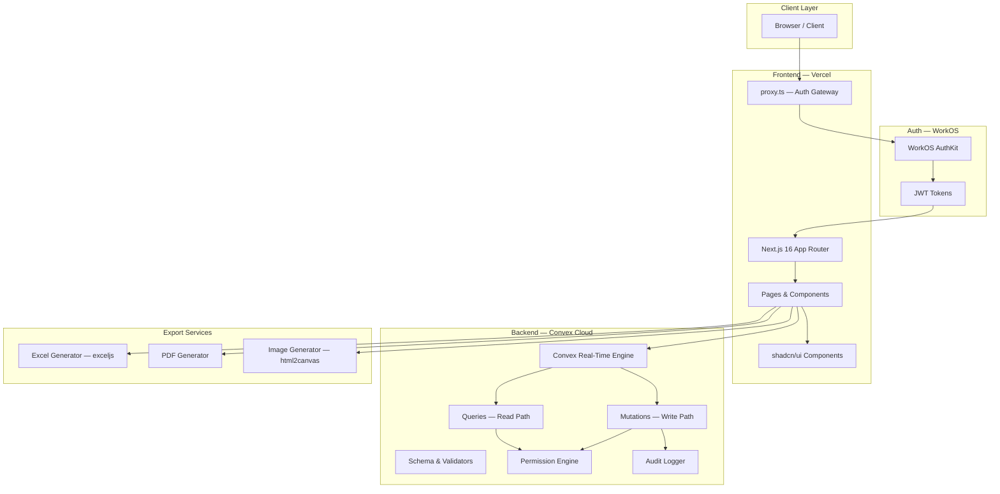
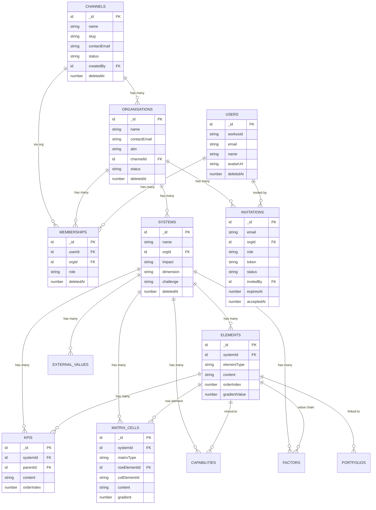
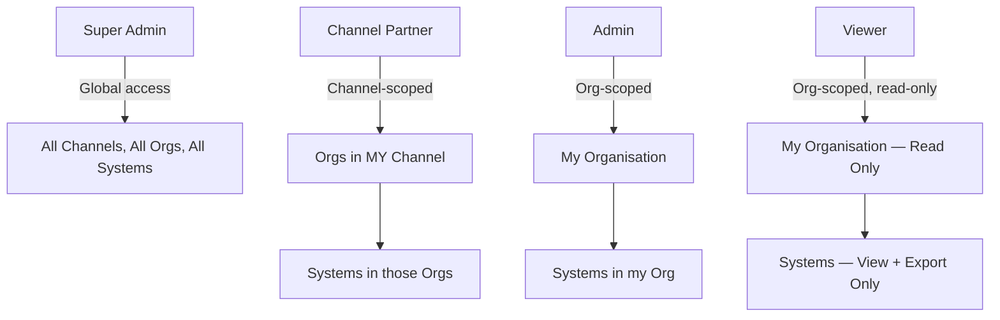
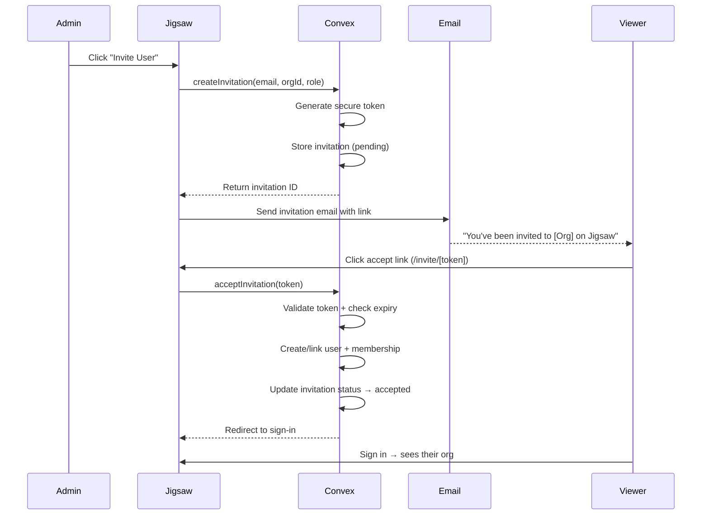

---
stepsCompleted:
  - step-01-init
  - step-02-context
  - step-03-starter
  - step-04-decisions
  - step-05-patterns
  - step-06-structure
  - step-07-validation
  - step-08-complete
inputDocuments:
  - prd.md
  - project-context.md
  - schema.ts
  - permissions.ts
  - BMAD_INTEGRATION_BRIEF_CLEAN.md
classification:
  projectType: SaaS B2B Strategic Planning Platform
  architectureType: Brownfield Evolution
  complexity: High
---

# Architecture Document — Jigsaw 1.6 RSA

**Author:** Winston (BMAD Architect) + Claudia (Orchestrator)
**Date:** 2026-02-24
**Version:** 1.0
**Status:** Final

---

## 1. System Overview

### 1.1 High-Level Architecture

Jigsaw 1.6 RSA is a multi-tenant strategic planning platform serving consulting firms and their clients. The system renders interactive visualisation views for organisational strategy with real-time collaboration.



### 1.2 Key Architecture Principles

1. **Convex-first**: All data operations go through Convex. No direct DB access, no REST APIs, no Supabase.
2. **Auth at the boundary**: Security enforced at Convex query/mutation level via `requireAuth()` and `requireRole()`.
3. **Real-time by default**: Convex's reactive queries eliminate manual cache invalidation.
4. **Soft delete everywhere**: `deletedAt` timestamp pattern. Never hard delete.
5. **Schema evolution**: Additive changes only. New fields are optional. Existing data never broken.
6. **Boring technology**: No unnecessary complexity. Use what works. Convex handles the hard parts.

---

## 2. Technology Stack

| Layer | Technology | Version | Constraint |
|-------|------------|---------|------------|
| Framework | Next.js (App Router) | 16.0.10 | `proxy.ts` NOT `middleware.ts` |
| UI Library | React | 19.2.0 | `OrgContext.Provider` NOT `<OrgContext>` |
| Language | TypeScript | ^5 | `strict: true` |
| Styling | Tailwind CSS 4 | ^4.1.9 | OKLCH colour vars |
| Components | shadcn/ui (New York) | 57 components | Add via CLI only |
| Backend/DB | Convex | ^1.31.7 | Separate deployment from Vercel |
| Auth | WorkOS AuthKit | ^2.14.0 | Must migrate to production keys |
| Charts | Recharts | 2.15.4 | — |
| Excel Export | exceljs | installed | Structural layout export |
| Package Manager | pnpm | 9.15.0 | NEVER npm/yarn |
| Deploy | Vercel | — | Auto-deploy on push to main |

### 2.1 Technology Decisions

**ADR-TECH-001: Convex as sole backend**
- *Decision*: All data through Convex. No Supabase, no REST.
- *Rationale*: Convex provides real-time reactivity, transactional mutations, and schema validation out of the box. Dual backends caused data integrity issues.
- *Alternatives rejected*: Supabase (removed), custom REST API (unnecessary overhead).

**ADR-TECH-002: WorkOS for auth**
- *Decision*: WorkOS AuthKit handles all authentication.
- *Rationale*: Enterprise-grade auth with SSO support for government/non-profit clients.
- *Constraint*: JWT contains only `subject` (WorkOS user ID). Email/name resolved via users table.

**ADR-TECH-003: Client-side export**
- *Decision*: Excel and image export generated client-side. PDF can be client-side or server-side.
- *Rationale*: No server infrastructure to maintain. exceljs works in browser. html2canvas for screenshots.
- *Trade-off*: Large exports may be slow on weak devices. Acceptable for current scale.

---

## 3. Data Architecture

### 3.1 Schema Evolution

The schema evolves from the current 12-table design to 14 tables. Changes are additive — no existing fields removed or renamed.

#### New Tables

**`channels`** — First-class entity for channel partner model
```typescript
channels: defineTable({
  name: v.string(),                        // "KPMG", "Deloitte"
  slug: v.string(),                        // URL-safe identifier
  contactEmail: v.optional(v.string()),
  status: v.union(v.literal("active"), v.literal("inactive")),
  createdBy: v.id("users"),
  deletedAt: v.optional(v.number()),
})
  .index("by_slug", ["slug"])
  .index("by_status", ["status"])
```

**`invitations`** — Token-based viewer/admin onboarding
```typescript
invitations: defineTable({
  email: v.string(),
  orgId: v.id("organisations"),
  role: roleValidator,                     // admin or viewer
  token: v.string(),                       // Secure random token
  status: v.union(
    v.literal("pending"),
    v.literal("accepted"),
    v.literal("declined"),
    v.literal("expired")
  ),
  invitedBy: v.id("users"),
  expiresAt: v.number(),                   // Timestamp
  acceptedAt: v.optional(v.number()),
  deletedAt: v.optional(v.number()),
})
  .index("by_token", ["token"])
  .index("by_email", ["email"])
  .index("by_org", ["orgId"])
  .index("by_status", ["status"])
```

#### Modified Tables

**`organisations`** — Add channelId reference
```typescript
// ADD to existing organisations table:
channelId: v.optional(v.id("channels")),   // Replace string `channel` field
// Existing `channel` string field kept for backward compat during migration
```
New index: `.index("by_channel", ["channelId"])`

**Role validator evolution:**
```typescript
const roleValidator = v.union(
  v.literal("super_admin"),
  v.literal("channel_partner"),  // NEW
  v.literal("admin"),
  v.literal("viewer")
)
```

### 3.2 Entity Relationship Diagram



### 3.3 Data Access Patterns

| Operation | Table(s) | Auth Required | Pattern |
|-----------|----------|---------------|---------|
| List my organisations | organisations, memberships | Authenticated | Filter by user's memberships or channel |
| List systems in org | systems | Org member | Filter by orgId + soft delete check |
| CRUD elements | elements | Admin+ in org | requireWriteAccess → systemId chain |
| CRUD matrix cells | matrixCells | Admin+ in org | requireWriteAccess → systemId chain |
| Invite viewer | invitations | Admin+ in org | requireRole(admin/super_admin) |
| Manage channels | channels | Super Admin | isSuperAdmin() check |
| Export system | systems + all children | Org member | Read-only, full system graph |

---

## 4. Security Architecture

### 4.1 Four-Tier Permission Model



### 4.2 Access Control Matrix

| Action | Super Admin | Channel Partner | Admin | Viewer |
|--------|:-----------:|:---------------:|:-----:|:------:|
| View all organisations | ✅ | ❌ (channel only) | ❌ (own org) | ❌ (own org) |
| Create organisation | ✅ | ✅ (in own channel) | ❌ | ❌ |
| Manage channels | ✅ | ❌ | ❌ | ❌ |
| Manage users/roles | ✅ | ❌ | ✅ (own org, admin/viewer only) | ❌ |
| Create/edit systems | ✅ | ❌ | ✅ (own org) | ❌ |
| Delete systems | ✅ | ❌ | ✅ (own org) | ❌ |
| View systems | ✅ | ✅ (channel orgs) | ✅ (own org) | ✅ (own org) |
| Export data | ✅ | ✅ | ✅ | ✅ |
| Send invitations | ✅ | ✅ (channel orgs) | ✅ (own org) | ❌ |
| View audit logs | ✅ | ❌ | ❌ | ❌ |
| Manage admin console | ✅ | ❌ | ❌ | ❌ |

### 4.3 Permission Engine Evolution

New functions to add to `convex/lib/permissions.ts`:

```typescript
// Check if user is a channel partner
// Channel partner membership is stored in the `memberships` table with role="channel_partner"
// and the orgId pointing to a "channel org" — an org whose channelId is set.
// Alternatively, a dedicated `channelMemberships` bridge table (channelId + userId) can be used.
// Decision: Use memberships table with role="channel_partner". The orgId on the membership
// indicates which org they partner for; the channelId on that org determines their channel scope.
async function isChannelPartner(ctx, userId): Promise<boolean>

// Get channel ID(s) for a channel partner by looking up their memberships
// where role="channel_partner", then resolving the channelId from those orgs
async function getPartnerChannelIds(ctx, userId): Promise<Id<"channels">[]>

// Get accessible org IDs — EVOLVED to include channel scoping
async function getAccessibleOrgIds(ctx, userId): Promise<{
  orgIds: Id<"organisations">[];
  isSuperAdmin: boolean;
  isChannelPartner: boolean;
  channelIds: Id<"channels">[];
}>

// Channel-aware org access check
async function canAccessOrganisation(ctx, userId, orgId): Promise<boolean>
```

**Permission resolution order:**
1. Is user authenticated? → `requireAuth()`
2. Is user super_admin? → Global access
3. Is user channel_partner? → Check org's channelId matches user's channel membership
4. Is user admin/viewer in org? → Check memberships table
5. Is system legacy (no orgId)? → Accessible to all authenticated (migration period)

### 4.4 Security Boundaries

- **Auth boundary**: `proxy.ts` (Next.js 16) handles WorkOS JWT validation
- **Data boundary**: Every Convex query/mutation checks permissions before data access
- **Tenant boundary**: `orgId` on systems table. Channel partners scoped by `channelId` on organisations
- **Audit boundary**: All mutations log to `auditLogs` via `logAudit()` helper
- **Session boundary**: WorkOS manages session lifecycle. "Keep me logged in" controls cookie persistence.

---

## 5. API Design — Convex Patterns

### 5.1 Shared Mutation Layer

The root cause of cross-model bugs (ADR-017) is inconsistent mutation patterns across views. The architecture mandates a shared mutation layer.

**Pattern: `convex/lib/mutations.ts`** (NEW)

```typescript
// Shared mutation wrapper that enforces:
// 1. Auth gating
// 2. Write access check
// 3. Audit logging
// 4. Consistent error handling

export async function withWriteAccess<T>(
  ctx: MutationCtx,
  systemId: Id<"systems">,
  action: string,
  resourceType: string,
  fn: (user: Doc<"users">) => Promise<T>
): Promise<T> {
  const user = await requireAuth(ctx);
  await requireWriteAccess(ctx, user._id, systemId);

  try {
    const result = await fn(user);
    await logAudit(ctx, {
      userId: user._id,
      userEmail: user.email,
      action,
      resourceType,
      resourceId: systemId,
      orgId: /* resolve from system */,
    });
    return result;
  } catch (error) {
    // Log failed mutation attempt
    await logAudit(ctx, {
      userId: user._id,
      userEmail: user.email,
      action: `${action}_FAILED`,
      resourceType,
      resourceId: systemId,
      details: { error: error.message },
    });
    throw error;
  }
}
```

**Adoption strategy:** All existing mutation files (elements.ts, matrixCells.ts, kpis.ts, capabilities.ts, externalValues.ts, factors.ts) will be refactored to use `withWriteAccess()` as part of Epic 1 (Core Stability). New mutations MUST use the shared layer from day one. The refactoring order follows the sprint priority: elements first (most bugs), then matrixCells, then remaining tables.

**Usage in any model's mutations:**
```typescript
// convex/elements.ts
export const update = mutation({
  args: { elementId: v.id("elements"), content: v.string() },
  handler: async (ctx, args) => {
    const element = await ctx.db.get(args.elementId);
    if (!element) throw new Error("Element not found");

    return withWriteAccess(ctx, element.systemId, "update_element", "element", async (user) => {
      await ctx.db.patch(args.elementId, { content: args.content });
      return { success: true };
    });
  },
});
```

### 5.2 Query Patterns

**Standard query pattern with skip:**
```typescript
// Frontend: always guard with auth check
const systems = useQuery(
  api.systems.list,
  user ? { orgId: selectedOrgId } : "skip"
);
```

**Query with channel scoping:**
```typescript
// convex/organisations.ts — list query
export const list = query({
  handler: async (ctx) => {
    const user = await getCurrentUser(ctx);
    if (!user) return [];

    const { orgIds, isSuperAdmin, isChannelPartner, channelIds } =
      await getAccessibleOrgIds(ctx, user._id);

    if (isSuperAdmin) {
      // Return all active orgs
      return ctx.db.query("organisations")
        .filter(q => q.eq(q.field("deletedAt"), undefined))
        .collect();
    }

    if (isChannelPartner) {
      // Return orgs in partner's channels
      return ctx.db.query("organisations")
        .filter(q =>
          q.and(
            q.eq(q.field("deletedAt"), undefined),
            q.or(...channelIds.map(chId =>
              q.eq(q.field("channelId"), chId)
            ))
          )
        )
        .collect();
    }

    // Admin/Viewer: return orgs user has membership in
    const orgs = await Promise.all(
      orgIds.map(id => ctx.db.get(id))
    );
    return orgs.filter(o => o && !o.deletedAt);
  },
});
```

### 5.3 Mutation Categories

| Category | Files | Shared Layer | Auth Level |
|----------|-------|-------------|------------|
| Element CRUD | `elements.ts` | `withWriteAccess` | Admin+ in org |
| Matrix Cell CRUD | `matrixCells.ts` | `withWriteAccess` | Admin+ in org |
| KPI CRUD | `kpis.ts` | `withWriteAccess` | Admin+ in org |
| Capability CRUD | `capabilities.ts` | `withWriteAccess` | Admin+ in org |
| External Value CRUD | `externalValues.ts` | `withWriteAccess` | Admin+ in org |
| Factor CRUD | `factors.ts` | `withWriteAccess` | Admin+ in org |
| System management | `systems.ts` | `withWriteAccess` | Admin+ in org |
| Org management | `organisations.ts` | Direct + audit | Super Admin or Channel Partner |
| User management | `memberships.ts` | Direct + audit | Admin+ in org |
| Channel management | `channels.ts` (NEW) | Direct + audit | Super Admin only |
| Invitations | `invitations.ts` (NEW) | Direct + audit | Admin+ in org |

---

## 6. Component Architecture

### 6.1 Page Structure

```
app/
├── page.tsx                    # Landing page (unauthenticated) — FR-001
├── layout.tsx                  # Root layout with ConvexProvider + AuthProvider
├── proxy.ts                    # WorkOS auth gateway (NOT middleware.ts)
├── dashboard/
│   └── page.tsx               # Authenticated home — system selector
├── system/[id]/
│   ├── page.tsx               # System view — default Logic Model
│   ├── logic-model/           # Logic Model view
│   ├── contribution-map/      # Contribution Map view (ADR-006: deferred)
│   ├── development-pathways/  # Development Pathways view
│   └── convergence-map/       # Convergence Map view (ADR-006: deferred)
├── admin/
│   ├── layout.tsx             # Admin layout (super_admin gate)
│   ├── clients/page.tsx       # Organisation CRUD
│   ├── users/page.tsx         # User management + role assignment
│   ├── channels/page.tsx      # NEW — Channel management
│   ├── audit/page.tsx         # Audit log viewer
│   └── trash/page.tsx         # Soft-deleted records recovery
├── invite/
│   └── [token]/page.tsx       # NEW — Invitation accept/decline
```

### 6.2 Shared Component Patterns

**Mode Controller** — Single source of truth for view modes:
```typescript
// components/mode-controller.tsx
type ViewMode = "view" | "edit" | "colour" | "order" | "delete";

interface ModeControllerProps {
  currentMode: ViewMode;
  onModeChange: (mode: ViewMode) => void;
  userRole: Role;  // Hide edit/delete for viewers
}
```

**Node Component** — Shared across all views:
```typescript
// components/node.tsx
interface NodeProps {
  content: string;
  mode: ViewMode;
  isEmpty: boolean;      // FR-033: colour differentiation
  gradientValue?: number; // FR-022: KPI health colour
  onSave: (content: string) => Promise<void>;
  onDelete: () => Promise<void>;
  placeholder?: string;  // FR-032: guidance text
}
```

**Save Feedback** — Global save confirmation:
```typescript
// components/save-feedback.tsx
// Toast notification system for FR-020
// Shows success (green check), failure (red X), or saving (spinner)
// Uses sonner (shadcn's toast) for consistent UX
```

### 6.3 State Management

- **Server state**: Convex `useQuery()` hooks — real-time, auto-updated
- **Auth state**: `useConvexAuth()` for auth readiness (NOT `useAuth()`)
- **Org context**: `OrgContext.Provider` (React 19 classic API) for selected org
- **UI state**: React `useState` for mode selection, dialogs, etc.
- **No global state library needed** — Convex handles server state; React context handles UI state

---

## 7. Export Architecture

### 7.1 Excel Export (FR-029)

**Library**: exceljs (already installed)
**Approach**: Client-side generation

```typescript
// lib/export/excel.ts
interface ExcelExportOptions {
  system: SystemWithChildren;  // Full system graph
  view: "logic-model" | "contribution" | "development" | "convergence";
  includeKPIs: boolean;
}

// Structure: NOT flat table
// Sheet 1: System Overview (Impact, Dimension, Challenge)
// Sheet 2: Logic Model Grid (preserving Jigsaw visual layout)
//   - Rows = Value Chain elements
//   - Columns = Outcomes (top), Resources (bottom)
//   - Cells = content with formatting
// Sheet 3: KPIs (element → KPI mapping with health colours)
```

**Key design decision**: The Excel output mirrors the visual Jigsaw layout, not a database dump. Cells are merged, coloured, and formatted to resemble the on-screen view. This is the #1 user action and must feel professional.

### 7.2 PDF Export (FR-030)

**Approach**: Client-side using `html2pdf.js` or `jspdf` + `html2canvas`
- Capture the current view as rendered HTML
- Convert to PDF with proper margins, headers, and page breaks
- Include system name, org name, export date in header
- Board-ready formatting with CPF branding

### 7.3 Image Export (FR-031)

**Library**: html2canvas
**Approach**: Screenshot the current view element
- Capture at 2x resolution for clarity
- Output as PNG
- Include title bar with system name

### 7.4 Export Component

```typescript
// components/export-menu.tsx
// Dropdown with: "Export as Excel" | "Export as PDF" | "Export as Image"
// Visible to all authenticated users (FR mapping: all roles can export)
// Uses loading state during generation
```

---

## 8. Invitation System

### 8.1 Invitation Flow



### 8.2 Security Rules

- Tokens are generated using `crypto.randomBytes(32).toString('base64url')` (Node.js crypto)
- Tokens are hashed (SHA-256) before storage — raw token only sent via email, never stored
- Tokens expire after 7 days (configurable via environment variable)
- Each token is single-use (status changes to accepted/declined on first use; subsequent attempts rejected)
- Admins can only invite to their own organisation
- Channel Partners can invite to any org in their channel
- Super Admins can invite to any org
- Invitation emails are the ONLY onboarding path (no self-signup) per ADR-007

### 8.3 Email Integration

**Phase 1** (MVP): No email service. Invitation link displayed in UI for admin to copy and share manually.
**Phase 2**: Integration with email service (Resend, SendGrid, or AWS SES) for automated invitation emails.

---

## 9. Infrastructure

### 9.1 Environments

| Environment | URL | Convex | Purpose |
|-------------|-----|--------|---------|
| Production | jigsaw-1-6-rsa.vercel.app | hidden-fish-6 | Live client access |
| Staging | TBD (Vercel preview) | TBD | Pre-production testing |
| Development | localhost:3000 | `npx convex dev` | Local development |

### 9.2 Deployment Pipeline

```
Feature Branch → PR → Vercel Preview Deploy → Manual QA → Merge to main → Vercel Production Deploy
                                                                        → npx convex deploy (separate)
```

**Critical**: Convex deployment is SEPARATE from Vercel. After merging:
1. Vercel auto-deploys the frontend
2. `npx convex deploy` must be run manually for schema/function changes

### 9.3 Environment Variables

| Variable | Where | Notes |
|----------|-------|-------|
| `WORKOS_API_KEY` | Vercel env | Must migrate from `sk_test_` to `sk_live_` |
| `WORKOS_CLIENT_ID` | Vercel env | WorkOS dashboard |
| `WORKOS_COOKIE_PASSWORD` | Vercel env | ≥32 char random string |
| `NEXT_PUBLIC_CONVEX_URL` | Vercel env | Convex deployment URL |
| `CONVEX_DEPLOY_KEY` | CI/CD (future) | For automated Convex deploys |

---

## 10. Architectural Decision Records

### ADR-001: Four-Tier Role Model
- **Context**: Current 3-tier (super_admin/admin/viewer) doesn't support channel partner use case.
- **Decision**: Add `channel_partner` role with channel-scoped visibility.
- **Consequences**: New `channels` table, permission engine evolution, admin UI for channels.
- **Alternatives rejected**: Separate apps per partner (too complex), role inheritance (over-engineering).

### ADR-002: Shared Mutation Layer
- **Context**: Cross-model bugs (BUG-012, BUG-018) caused by inconsistent mutation patterns.
- **Decision**: `withWriteAccess()` wrapper in `convex/lib/mutations.ts` enforces auth, audit, and error handling.
- **Consequences**: All mutations refactored to use shared layer. Consistent behaviour guaranteed.
- **Alternatives rejected**: Per-model copy-paste (caused the current bugs), ORM-like abstraction (over-engineering for Convex).

### ADR-003: Client-Side Export with Server Fallback Path
- **Context**: Users need Excel, PDF, and image exports.
- **Decision**: Primary export path is client-side using exceljs, html2canvas, and html2pdf. For systems exceeding 200 nodes (unlikely in current usage), implement a Convex action-based server-side fallback using exceljs in Node.js.
- **Consequences**: No server infrastructure needed for MVP. Server fallback via Convex actions (no separate server). Large exports have a scalable path.
- **Alternatives rejected**: Server-side Puppeteer (requires separate server infra), third-party export service (cost, dependency).

### ADR-004: Token-Based Invitations (No Self-Signup)
- **Context**: Enterprise clients require controlled access.
- **Decision**: Invitation-only model. No self-signup. Tokens are single-use, time-limited.
- **Consequences**: Onboarding requires admin action. Reduces attack surface. Aligns with enterprise expectations.
- **Alternatives rejected**: Magic link self-signup (too open), SSO federation (Phase 2+).

### ADR-005: Schema Evolution (Not Migration)
- **Context**: Production database has 7 orgs of live client data.
- **Decision**: All schema changes are additive. New fields are `v.optional()`. Existing data never modified.
- **Consequences**: Legacy systems (no orgId) remain accessible during transition. Gradual migration.
- **Alternatives rejected**: Database migration script (risky with live data), parallel deployment (complex).

### ADR-006: Focus on Logic Model View
- **Context**: Four views exist but only Logic Model is commercially critical right now.
- **Decision**: Fix Logic Model completely. Other views get bug fixes only (no new features).
- **Consequences**: Reduces scope by ~60%. Development Pathways gets bug fixes for RA Tasmania.

### ADR-007: Performance vs Stage Mode Consolidation (FR-042)
- **Context**: Performance mode and Stage "Show KPIs" display the same data differently.
- **Decision**: Consolidate into a single "Performance" mode that shows KPI values with health colours inside nodes. Remove the separate "Show KPIs" toggle.
- **Consequences**: Simpler UX, one fewer mode to maintain, aligns with FEAT-015 vision.

---

## 11. FR → Architecture Mapping

| FR | Architectural Component | Key Files |
|----|------------------------|-----------|
| FR-001 | Landing page (app/page.tsx) | `app/page.tsx` |
| FR-002 | Auth flow (proxy.ts redirect) | `proxy.ts`, header component |
| FR-003 | WorkOS session config | `proxy.ts`, WorkOS dashboard |
| FR-004 | Role validator + permission engine | `convex/schema.ts`, `convex/lib/permissions.ts` |
| FR-005 | Admin channels page | `app/admin/channels/page.tsx`, `convex/channels.ts` |
| FR-006 | Channel partner org creation | `convex/organisations.ts`, permissions |
| FR-007 | Channel-scoped query filtering | `convex/organisations.ts`, `getAccessibleOrgIds()` |
| FR-008 | Invitation mutations | `convex/invitations.ts` |
| FR-009 | Token generation + email | `convex/invitations.ts`, `app/invite/[token]/` |
| FR-010 | Header component | `components/header.tsx` |
| FR-011–016 | Shared mutation layer | `convex/lib/mutations.ts`, element/matrix mutations |
| FR-017 | Node component edit mode | `components/node.tsx` |
| FR-018 | Delete mode + shared mutations | Element mutations + delete UI |
| FR-019 | Convex reactive queries (automatic) | useQuery patterns |
| FR-020 | Toast notification system | `components/save-feedback.tsx` (sonner) |
| FR-021 | Mode controller component | `components/mode-controller.tsx` |
| FR-022 | Colour mode + gradient values | Node component + KPI threshold logic |
| FR-023 | Order mode + arrow visibility | Mode controller + node component |
| FR-024 | Mode-specific control rendering | Mode controller + conditional rendering |
| FR-025 | Add System modal | `components/add-system-dialog.tsx` |
| FR-026 | System creation mutation | `convex/systems.ts` (empty init) |
| FR-027 | Systems dropdown | Sidebar component + org query |
| FR-028 | Data fix for "Unknown" orgs | One-time data migration |
| FR-029 | Excel export | `lib/export/excel.ts` |
| FR-030 | PDF export | `lib/export/pdf.ts` |
| FR-031 | Image export | `lib/export/image.ts` |
| FR-032 | Placeholder text in nodes | Node component `placeholder` prop |
| FR-033 | Empty vs filled node colour | Node component `isEmpty` prop + CSS |
| FR-034 | Favicon | `app/favicon.ico` |
| FR-035 | Convex indicator | Remove/hide in layout |
| FR-036 | Single sign-in button | Auth UI component |
| FR-037 | BMAD pipeline QA | Process (not code) |
| FR-038 | Feature branches | Process (git workflow) |
| FR-039 | Shared mutation layer | `convex/lib/mutations.ts` |
| FR-040 | Undo (Phase 3) | Deferred — requires state history design |
| FR-041 | KPI in nodes (Phase 3) | Deferred — node component enhancement |
| FR-042 | Mode consolidation | Mode controller refactor |

---

## 12. Migration Strategy

### 12.1 Three-Tier → Four-Tier Migration

**Phase 1: Schema Addition (non-breaking)**
1. Add `channels` table (empty initially)
2. Add `invitations` table (empty initially)
3. Add `channel_partner` to roleValidator
4. Add `channelId` (optional) to organisations
5. Deploy schema changes — existing data unaffected

**Phase 2: Permission Engine Update**
1. Add `isChannelPartner()`, `getPartnerChannelIds()` functions
2. Update `getAccessibleOrgIds()` to include channel scoping
3. Add `canAccessOrganisation()` function
4. All existing queries/mutations continue working (backward compatible)

**Phase 3: Data Population**
1. Create initial channels (e.g., "CPF Direct")
2. Assign `channelId` to existing organisations
3. Create first channel partner memberships

**Phase 4: UI Rollout**
1. Add channel admin page (`app/admin/channels/`)
2. Add invitation page (`app/invite/[token]/`)
3. Update header to show role
4. Update org list to use channel-scoped queries

### 12.2 Rollback Strategy

Every phase is independently reversible:
- Phase 1: New tables can be dropped (no data dependencies)
- Phase 2: New functions are additive (old code still works)
- Phase 3: Data assignments are soft (channelId is optional)
- Phase 4: UI pages are new routes (removing them breaks nothing)

---

*End of Architecture Document*
